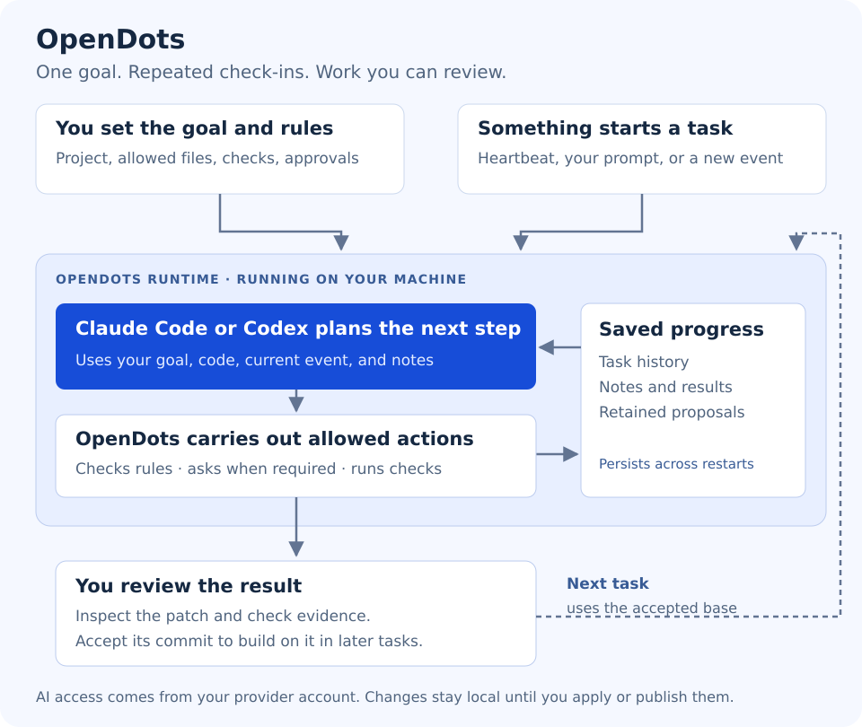

# OpenDots



**Give an AI agent a goal. Let it return to that goal over time. Review what it does.**

OpenDots is an open-source program that runs on your computer and coordinates AI agents working on a code repository. You give an agent a goal, choose which files it may change, and decide which actions need your approval. Claude Code or Codex supplies the AI; OpenDots manages when work starts, what is allowed, and what gets saved.

For example: **“Keep improving this project's setup errors so a new user knows what to do next.”** OpenDots can check in every 30 minutes, look at the code and previous notes, choose a useful next step, and propose a small change. A new issue or feedback message can also trigger work.

A scheduled check-in is called a **heartbeat**. An incoming message is an **event**. The **runtime** is the OpenDots process you leave running. In configuration, each agent and its goal is called a **target**.

[Features](#what-can-it-do) · [Requirements](#what-you-need) · [First run](#run-it-for-the-first-time) · [Talk to your agent](#interact-with-your-agent)

## What can it do?

- **Work toward a saved goal:** revisit an objective without you repeating the prompt each time.
- **Check in on a schedule:** use heartbeats to reassess progress while the runtime is running.
- **Respond to new information:** receive your prompts, GitHub activity, or messages from your own tools.
- **Investigate and propose changes:** read allowed files, compare next steps, and run checks you configure.
- **Keep you in control:** require approval for changes and retain a patch and Git branch for review.
- **Remember progress:** keep task history and notes across restarts; accept a proposal to carry its code into future tasks.
- **Manage multiple agents:** configure their goals, permissions, schedules, and event sources separately.
- **Use a terminal or browser:** both interfaces connect to the same local runtime.

**Current stage:** a local prototype for repository work. It does not automatically publish GitHub PRs, deploy your application, or pull upstream changes. Model calls use your provider account and its limits. A check passing proves only what that check covers.

## What you need

| Requirement | Why you need it |
| --- | --- |
| **A Linux machine** with working Bubblewrap namespaces | Runs the runtime and isolates configured checks. The walkthrough below uses Ubuntu/Debian; native macOS and Windows are not this setup. |
| **Python 3.11 or newer, Git, and Bubblewrap** | Runs OpenDots and keeps reviewable code changes. |
| **Claude Code or Codex CLI, installed and signed in** | Provides the AI that chooses the next steps. Pick one; you do not need both. |
| **Internet access and an account that can use your chosen provider** | Lets the planning CLI contact its model service. OpenDots does not include model access. |

You do **not** need Docker, a cloud server, or a GitHub token for the first run. We will use the OpenDots repository itself as the agent's real project.

## Run it for the first time

### 1. Prepare your machine

On Ubuntu/Debian, open a terminal and run:

```bash
sudo apt-get update
sudo apt-get install git bubblewrap python3 python3-venv curl
python3 --version
```

The version must be **3.11 or newer**. If your distribution provides an older Python, install a supported Python before continuing. Bubblewrap must also be usable on your machine; the diagnostic in step 4 checks that.

### 2. Set up the AI

This walkthrough uses **Claude Code**. If it is not installed, follow the [official Claude Code installation instructions](https://code.claude.com/docs/en/overview). Then run:

```bash
claude --version
claude auth login
claude auth status
```

Finish signing in before continuing. Already use Codex? Follow [provider setup](docs/PROVIDERS.md), sign in to Codex, and change `"backend": "claude"` to `"backend": "codex"` in the file used below.

### 3. Download OpenDots and look at the goal

```bash
git clone https://github.com/Shashankss1205/OpenDots.git
cd OpenDots
```

Open [`examples/goal-agent.json`](examples/goal-agent.json) in your editor. It already defines one agent, named `project`, with this goal:

> Improve OpenDots' error messages for missing configuration, unavailable AI providers, and invalid project paths. Compare useful next steps and propose one focused change at a time.

For this first run, you can keep the configuration as it is:

- The agent works on a managed copy of this actual repository.
- It may propose edits to `opendots/setup.py` and `opendots/__main__.py`.
- It asks before writing; it can read files, save notes, and run the configured Python syntax check automatically.
- It checks in every 30 minutes, with an initial check-in at startup.

The included check verifies **Python syntax**, not whether an improvement is correct. Inspect the proposal and add suitable behavioral tests before accepting a fix.

### 4. Check that everything is ready

From the `OpenDots` directory:

```bash
python3 -m opendots --config examples/goal-agent.json doctor
```

Look for the top-level **`"ok": true`**. If it is false, fix the reported problem first—usually provider login, a missing executable, or unavailable Bubblewrap isolation. A successful diagnostic means the prerequisites pass; your first completed task is the live test of the full workflow.

These commands run directly from the downloaded source. You do not need to install a Python package for this walkthrough.

### 5. Start the runtime

In the same terminal:

```bash
python3 -m opendots --config examples/goal-agent.json serve --port 8766
```

**Leave this terminal open.** This is the process that runs the agents. The first heartbeat can start work immediately, so provider usage may begin now. Further planning is limited by the configured budgets.

### 6. Open the agent interface

Open a **second terminal**, go to the same `OpenDots` directory, and run:

```bash
python3 -m opendots tui --url http://127.0.0.1:8766
```

You should see a connected terminal interface. You can also open **http://127.0.0.1:8766** in a browser on the same machine for the local dashboard.

## Interact with your agent

### Select it and give it a request

Type these into the **OpenDots prompt**, not your normal shell:

```text
/agents
/use project
Inspect the setup errors and propose one small improvement. Explain your choice before asking me to approve a change.
```

A request adds work to this agent's queue. If its startup heartbeat is already working, your request waits behind it. The agent may investigate, ask for approval, finish without an edit, or explain a blocker; a particular change is not guaranteed.

### See what is happening

| At the OpenDots prompt | What it does |
| --- | --- |
| `/status` | Shows the provider, connection health, and planning usage. |
| `/activity` | Shows recent activity. |
| `/reviews` | Lists tasks waiting for your approval. |
| `/work ID` | Shows a task's results and check evidence. Replace `ID` with its task number. |
| `/pause` / `/resume` | Stops or resumes the selected agent taking new work. |
| `/help` | Shows all available commands. |

### Review a change before allowing it

Suppose `/reviews` lists task **1**. Inspect it first:

```text
/review 1
```

If you agree with the proposed action:

```text
/approve 1
```

The interface asks you to type `approve 1` again to confirm. Use the actual task number you see. Each approval permits the displayed action; later writes may need another approval. You can use `/reject 1` instead.

After the task completes, inspect the result:

```text
/work 1
/proposal 1
```

`/proposal` shows the retained patch and an exact `/accept ID COMMIT` command. To carry that change into future tasks, pause the agent, finish or cancel other active work, then use the displayed acceptance command and resume. **Accepting changes the agent's working base; it does not modify your original checkout or push to GitHub.** [More about review and acceptance](docs/GOALS_AND_EVENTS.md#6-review-the-work-and-carry-progress-forward).

### Disconnect or stop

- **Close just the interface:** type `/quit` or press Ctrl+D. The runtime in the first terminal keeps running.
- **Stop the runtime:** press Ctrl+C in the first terminal. Start the same command again to reopen its saved state.
- **Pause new tasks:** use `/pause`. Incoming events can still queue; pausing does not cancel an active task.

## Give it your own project and connect events

Once you have completed a first task, [follow the configuration guide](docs/GOALS_AND_EVENTS.md#2-define-the-persistent-goal-and-allowed-work) to change the project directory (`workspace`), saved goal (`objective`), permitted files, and checks. Restart after editing the configuration. Typing a normal request does not replace the saved goal.

A source brings information in; a subscription decides which agent receives it. Connect both using the [event-stream guide](docs/GOALS_AND_EVENTS.md#5-connect-incoming-event-streams):

| Input | What it is for |
| --- | --- |
| Heartbeat | “Check progress again every 30 minutes.” |
| Terminal prompt | “Investigate this problem now.” |
| JSONL file or local HTTP request | Let a CI tool, log processor, or feedback collector send messages. |
| GitHub polling | React to new matching issue, comment, or PR activity. |
| Signed GitHub webhook | Receive GitHub deliveries through a separately configured receiver. |

Slack, email, and arbitrary file watching are not built-in connectors. Incoming GitHub activity also does not pull new code into the agent's copy; use the documented [source refresh workflow](docs/GOALS_AND_EVENTS.md#6-review-the-work-and-carry-progress-forward).

## Optional: install the short command

From your `OpenDots` checkout:

```bash
bash install.sh --source "$PWD"
export PATH="$HOME/.local/share/opendots/runtime/bin:$PATH"
opendots --help
```

This creates a separate Python environment without sudo. You can now use `opendots` instead of `python3 -m opendots`. Add that PATH line to your shell startup file to keep it in new terminals. Existing installations are not overwritten.

<details>
<summary>Run as a background service on Linux with systemd</summary>

Stop the foreground runtime first so two processes do not use the same database. From the checkout, with the installed command available:

```bash
opendots --config examples/goal-agent.json service install --name opendots-goal
opendots service start --name opendots-goal
opendots tui --url http://127.0.0.1:8765
```

The service uses port **8765**, whereas the first-run walkthrough uses **8766**. Use `opendots service status --name opendots-goal` to inspect it and `opendots service stop --name opendots-goal` to stop it. User services normally follow your login session; running after logout requires user lingering configured with your administrator.

</details>

## Need help?

| What you see | What to try |
| --- | --- |
| `claude` is missing or authentication fails | Finish provider installation/login, then rerun `doctor`. |
| `doctor` reports a sandbox failure | Check Linux Bubblewrap support and namespace permissions. |
| Kubernetes/React agents appear | You connected to another configuration. Use the explicit goal config and port **8766** above. |
| An agent is connected but idle | Check `/status`, pause state, `/reviews`, and the event subscriptions. |
| A task is waiting | Check `/reviews`; one waiting task blocks later work for that agent. |

For full setup and troubleshooting, read [Goals, heartbeats and events](docs/GOALS_AND_EVENTS.md). For authentication, read [Provider setup](docs/PROVIDERS.md).

## Learn more and contribute

- [Implementation](docs/IMPLEMENTATION.md): components, configuration, and runtime boundaries.
- [Validation](docs/VALIDATION.md): what has been tested and what remains unverified. Claude protocol tests do not establish a successful live model run.
- [Development](docs/DEVELOPMENT.md): tests, packaging, optional deterministic fixtures, deployment, and maintenance.
- [Roadmap](docs/ROADMAP.md) and [Contributing](CONTRIBUTING.md).

OpenDots is an independent experiment inspired by OpenAI's Dots idea. MIT licensed; see [LICENSE](LICENSE) and [NOTICE](NOTICE).
