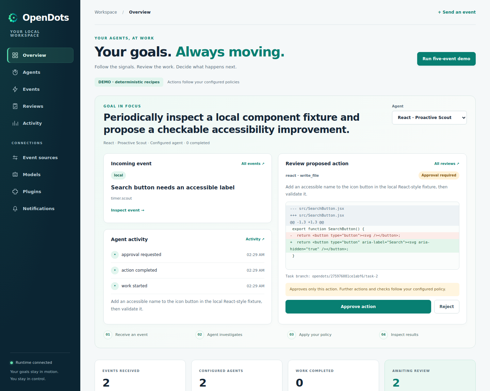
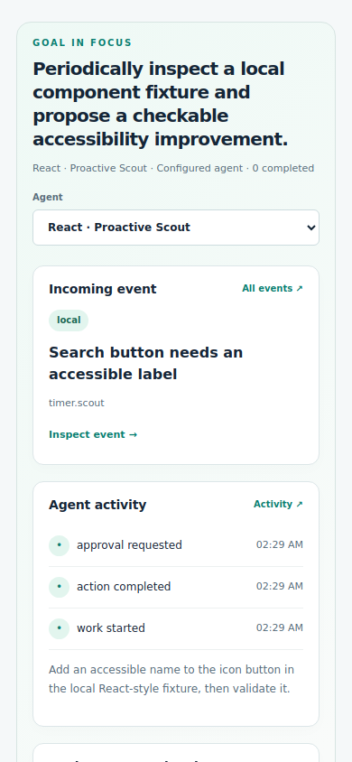

# Dashboard

Start `opendots serve` after configuring your own workspace and goal, then open
http://127.0.0.1:8765. The browser and terminal share the same runtime state.

The **Goal in focus** selector switches between configured agents. The overview
shows the selected agent's recent matching event, recent activity and next action
awaiting approval. The full agent, event, review and activity sections remain
available below, followed by event sources, models, plugins and notifications.
The overview uses the runtime's bounded recent event stream; search the full
event history if an older event is no longer visible there.

A review shows the proposed action and its exact preview. Green and red diff
lines mark additions and removals. **Approve action** approves only that action,
using its current approval token. Further actions and checks follow the target's
configured policy. **Reject** declines it. Both controls stay disabled while a
decision is being submitted, including another copy of the same review.
After work completes, **View retained patch** opens the actual saved patch.

If polling fails, a connection warning appears, previous data remains visible,
and mutation buttons are disabled. The warning clears when the runtime
reconnects. Action errors remain visible until dismissed or a new event is
successfully sent. No live model calls are started simply by opening the page.

## Visual examples

These are screenshots of the implemented dashboard with explicitly initialized
local demo fixtures. They are not generated mockups or evidence of a live model
run. Normal setup does not create these events or agents.





## Browser validation

```bash
python -m pip install playwright
python -m playwright install chromium
python scripts/check_event_ui.py
python scripts/check_dashboard_ui.py
```

The second check creates disposable fixture workspaces and uses explicitly
trusted local checks. It exercises selection, token-bound approvals, rejection,
retained patches, escaping, mobile width, disconnection/recovery and empty state.
No live provider or external account is used. To capture screenshots:

```bash
python scripts/check_dashboard_ui.py --screenshots /tmp/opendots-ui
```
