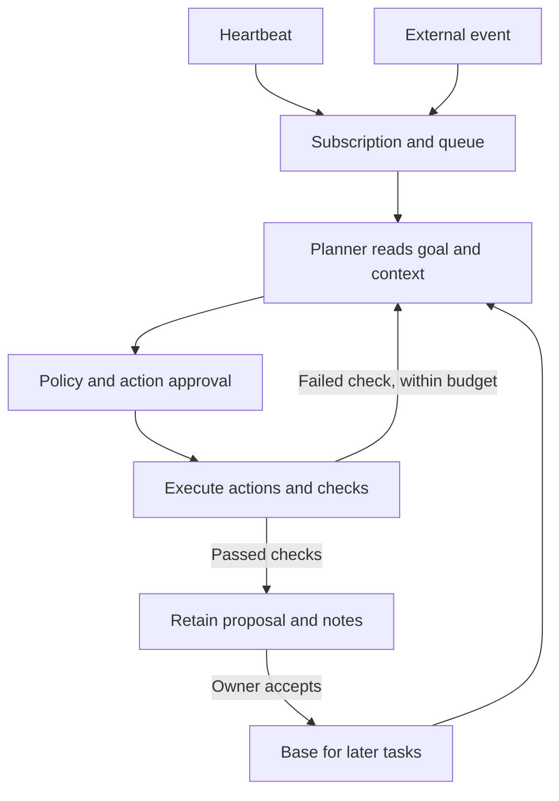

# Optional sample: a real goal with heartbeats and event streams

This is an opt-in worked sample, not the normal onboarding path. For your own project and goal, start with the [README](../README.md).

This walkthrough uses Claude Code or Codex to work on the **actual OpenDots
repository**. It has no deterministic recipes and creates no Kubernetes/React
fixtures. To use another repository, change the workspace, goal, write scopes and
checks as described below.

A goal is persistent owner configuration. A heartbeat is a recurring event that
asks the planner to reassess that goal. Other streams bring new evidence. The
planner can compare possible next steps, investigate and propose a bounded action.
This is repeated planning, not exhaustive exploration of every possibility.

## 1. Start with a real repository and provider

From an up-to-date OpenDots checkout, install/authenticate either
[Claude Code](https://code.claude.com/docs/en/overview) or Codex CLI under your
own account. See [provider setup](PROVIDERS.md). Python 3.11+, Git and working
Linux Bubblewrap namespaces are required for this configuration.

```bash
cd /path/to/OpenDots
claude auth login
claude auth status
python3 -m opendots --config examples/goal-agent.json doctor
```

The checked-in [configuration](../examples/goal-agent.json) uses `backend: claude`.
For Codex, set `"backend": "codex"` in that file and authenticate Codex. There is
no provider fallback if a CLI is missing, unauthenticated or fails.

The commands below use the checkout directly so an older installed `opendots`
command does not accidentally run a different client or provider implementation.
All configuration paths are relative to the configuration file. This example's
workspace is the real checkout; its database and inbox live in the sibling
`.opendots-goal` directory, outside the source repository.

## 2. Define the persistent goal and allowed work

Open `examples/goal-agent.json`. The example goal is:

> Improve the real OpenDots CLI's handling of missing configuration, unavailable
> providers and invalid workspace paths. Compare useful next steps, record a
> short decision summary, and propose at most one focused change per task.

These are the fields to understand:

| Field | Purpose |
| --- | --- |
| `targets[].objective` | Persistent natural-language goal and instructions |
| `workspace` | Real source directory to snapshot |
| `desired_state` | Additional goal context; descriptive fields are not automatically verified |
| `subscriptions` | Which incoming events may wake this target |
| `write_paths` | Files the agent may propose modifying |
| `policy` | Which actions are automatic, require approval, or are denied |
| `checks` / `required_checks` | Exact owner-selected commands and mandatory completion evidence |
| `schedules` | Recurring heartbeat events |
| `sources` | Adapters that bring events into the runtime |

The example allows proposals only for `opendots/setup.py` and
`opendots/__main__.py`. Writes require approval; reads, notes and the named syntax
check run automatically. Tests, CI, package metadata and LICENSE are protected.

**The example check proves Python syntax only.** It does not establish correctness
of a fix. Add suitable behavioral checks before accepting consequential changes.
Check commands are argv arrays, not shell strings. They run in a managed task
worktree with a 30-second bound; dependencies must be available in the configured
check environment. A source `.venv` is not copied into the task workspace.

For another repository, use an absolute `workspace` path, replace `objective`,
and set that project's write globs and check argv. For example, a Python project
with dependency-free unit tests can use `["{python}", "-m", "unittest",
"discover", "-s", "tests"]`. `{python}` means the OpenDots interpreter, not an
automatically discovered project virtual environment. Keep database/inbox paths
outside the source workspace. Targets need separate non-overlapping source paths.

Changing the persistent goal means editing `objective` and restarting the
runtime. A normal prompt is an individual request; it does not replace the stored
objective. `success_conditions` can additionally enforce specific text/JSON
values; arbitrary prose in `desired_state` is context rather than proof.

## 3. Start the runtime and open the terminal

Use a separate port to avoid connecting to an older fixture runtime:

```bash
python3 -m opendots --config examples/goal-agent.json serve --port 8766
```

In a second terminal, from the same checkout:

```bash
python3 -m opendots tui --url http://127.0.0.1:8766
```

Select the target and submit a request:

```text
/use project
Inspect the current setup failures. Compare useful improvements and propose the best small next step toward the configured goal.
/status
/activity
/reviews
```

The heartbeat also starts work automatically: a fresh schedule emits its current
tick when the service starts. A manual request may therefore queue behind that
first task. The configured provider must show `claude` or `codex` in `/status`.
Closing the terminal does not stop `serve`. Config/source edits require a runtime
restart. `drain` processes existing queued work; it does not run the heartbeat or
source-polling loop.

## 4. Understand the proactive heartbeat

The example includes this schedule:

```json
{
  "id": "project-heartbeat",
  "target_id": "project",
  "type": "timer.heartbeat",
  "interval_seconds": 1800,
  "payload": {"title": "Reassess progress toward the configured goal"}
}
```

Every 30 minutes, the running service emits a durable event. The ID combines the
schedule name and interval tick, so restarting within the same tick does not
create duplicate work. Missed intervals collapse to the current tick, rather than
replaying every missed interval. Scheduling uses clock-aligned intervals; it is
not a promise of exactly 30 minutes after a task completes.



Each invocation receives the persistent goal, current event, bounded repository
snapshot, recent target notes, and already executed results for this task. It can
request more reads and return for another planning round. Ask for a concise
comparison of candidate actions and an evidence-based decision summary; the UI
shows plans, actions and notes, not private model reasoning.

For this goal, possible candidates include improving a missing-config error,
identifying a missing executable, or clarifying an invalid workspace path. Which
one is chosen depends on the actual source and model output; none is a scripted
outcome. An investigation may legitimately make no edit or report a blocker.

A target has one active task at a time. Waiting for approval blocks later tasks
for that target. Heartbeats still queue while a target is paused; `/pause` stops
claiming work, not event ingestion. The example caps the queue at 100 and real
planning at 60 calls/day for this target, 120 globally. One heartbeat can consume
multiple calls; 48 daily ticks do not guarantee 48 completed tasks. Per-task
planning and repair limits also apply. Budget exhaustion blocks work for review.

## 5. Connect incoming event streams

**A source collects events; a subscription routes them.** Both must agree on the
normalized event type, source and optional repository. Explicit `target_id` does
not bypass subscription filters. Unmatched events are recorded with zero work.

| Input | Configure | Typical normalized events |
| --- | --- | --- |
| Plain terminal request | `owner.*` subscription, source `local` | `owner.request` |
| Heartbeat | `schedules` plus timer subscription | `timer.heartbeat` |
| Local HTTP producer | `POST /api/events` plus matching subscription | Any chosen type, e.g. `ci.failed` |
| JSONL inbox | `kind: jsonl` source plus matching subscription | `ci.failed`, `feedback.received` |
| GitHub polling | `kind: github_poll` source plus GitHub subscription | `github.issue.opened`, `github.comment.created`, `github.pr.opened` |
| Signed GitHub webhook | HTTP endpoint and webhook secret, plus subscription | Same normalized GitHub event family |

Keep owner and timer subscriptions separate from repository-filtered GitHub
rules. Otherwise a heartbeat without `payload.repo` will not match.

### JSONL: feed your own tools into the agent

The example already polls a JSONL inbox every five seconds. From the checkout:

```bash
mkdir -p ../.opendots-goal
python3 - <<'PY'
import json, uuid
from pathlib import Path
entry = {
    "id": str(uuid.uuid4()), "type": "feedback.received", "source": "file",
    "target_id": "project",
    "payload": {"title": "Setup feedback", "body": "Please inspect whether missing configuration tells users how to create it."}
}
with Path('../.opendots-goal/events.jsonl').open('a') as stream:
    stream.write(json.dumps(entry) + '\n')
PY
```

Have a real CI/log/feedback adapter append the same envelope with actual evidence.
The newline finishes the record. The cursor persists across restarts; malformed
complete records are audited and skipped. Reusing an ID with different content
is rejected. This is the current bridge for systems without a native connector.

### HTTP: send a request immediately

```bash
curl --fail-with-body http://127.0.0.1:8766/api/events \
  -H 'Content-Type: application/json' \
  -H 'X-OpenDots-Request: dashboard' \
  -d '{"type":"owner.request","source":"local","target_id":"project","payload":{"title":"Reassess goal progress","body":"Inspect current code and retained notes; choose a useful next step."}}'
```

A response with `queued: 1` confirms routing, not task completion. Without an ID,
each request is new. Producers that retry deliveries should supply a stable ID.

### GitHub: observe repository activity

Add an entry to the top-level `sources` array:

```json
{
  "id": "project-github",
  "kind": "github_poll",
  "repo": "Shashankss1205/OpenDots",
  "interval_seconds": 60,
  "bootstrap": "observe",
  "max_pages": 5,
  "token_env": "GITHUB_TOKEN"
}
```

Add a separate entry to the target's `subscriptions`:

```json
{
  "types": ["github.issue.*", "github.comment.*", "github.pr.*"],
  "sources": ["github"],
  "repos": ["Shashankss1205/OpenDots"]
}
```

Replace the repository in both places for your own project. Supply a GitHub token
through the service environment when needed, never in the config. Existing CLI
login does not automatically supply `GITHUB_TOKEN`. The default planner
allowlist does not forward this token. Restart after changing configuration.

`observe` establishes a baseline and waits for new activity; it does not enqueue
old issues on first connection. `replay` processes available recent events.
Polling uses repository event history, not a full issue backlog scan, and is
bounded rather than lossless. Server polling intervals are respected. GitHub
events do not automatically refresh the local source snapshot.

For GitHub webhooks, the runtime endpoint is `/api/webhooks/github`; set
`OPENDOTS_GITHUB_WEBHOOK_SECRET` in the runtime environment. Deliveries require
valid HMAC and GitHub event/delivery headers. GitHub cannot directly call your
localhost URL. An external receiver/relay must preserve signed body bytes and
forward locally with the accepted local Host header. A production ingress setup
is separate work; polling is the directly usable local setup. Do not expose the
whole unauthenticated local dashboard to receive webhooks.

Additional native stream types require a trusted source plugin. Slack, email,
browser activity and arbitrary file watching are not built-in connectors.

## 6. Review the work and carry progress forward

```text
/reviews
/review ID
/approve ID
```

Replace `ID` with the listed task number. The client then asks for `approve ID` to
confirm the exact action. Further writes may require further reviews. After
completion, inspect `/work ID` and `/proposal ID`. To make that completed commit
the base for future tasks, use `/accept ID COMMIT` with the displayed full commit.
Pause the target first and finish/cancel other active work if necessary, then
resume. Action approval permits one action; proposal acceptance advances the
future base. Neither pushes code or opens a GitHub PR.

Changes remain in managed branches/worktrees. If you edit or pull the source
repository yourself, finish/cancel active work, stop this runtime, run:

```bash
python3 -m opendots --config examples/goal-agent.json sync project
```

Then restart. Sync creates a new source generation and clears prior acceptance;
old proposals remain retained. It does not merge accepted changes into your
source automatically. This is why merely sending a GitHub event cannot claim the
agent has already seen the corresponding upstream code change.

## 7. Find out why nothing happened

| Symptom | Check |
| --- | --- |
| Old Kubernetes/React targets appear | Connect to port 8766 and start with the explicit goal config |
| Connected but idle | Check subscriptions, target pause state, budgets and `/status`; a description alone does not create a schedule |
| Event recorded, zero queued | Match type, source, repo and minimum priority; stars default below the normal attention threshold |
| Waiting for approval | Use `/review ID`; later tasks for that target remain queued |
| Provider failed | Run `doctor`; check CLI authentication, executable PATH, supported flags and timeout |
| Checks failed | Inspect `/work ID`; check named command, dependencies and sandbox availability |
| Changes repeat | Review and accept the prior proposal, or refresh the source deliberately |
| GitHub source is healthy but silent | `observe` ignores initial history; wait for new matching events |

## Validation boundary

The example configuration, heartbeat deduplication, subscription routing, JSONL
input and required check are exercised by repository tests. The Claude adapter
has subprocess/protocol and approval tests. No authenticated Claude or Codex model
was available for a fresh live run while preparing this guide. A successful
`doctor` plus a completed real-provider task in your environment is the remaining
live acceptance step; deterministic test planners do not establish that result.
